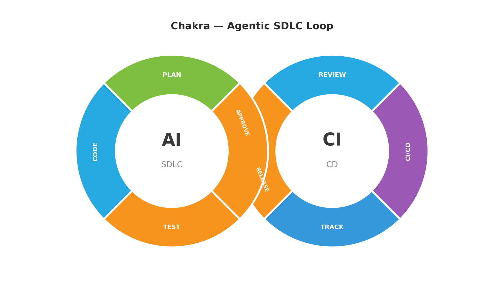

# Chakra

Agentic SDLC loop: drop in a user story, get a GitHub PR — autonomously planned, coded, and tested by Claude.

```
python3 orchestrator.py story.txt
```



---

## How It Works

1. Reads `story.txt` (plain text user story, first line used as title)
2. Claude breaks the story into tasks and writes them to a **Google Sheets Tasks tab**
3. A **Draft PR** is opened immediately so you can track progress
4. For each task, the orchestrator **polls Google Sheets** — set a task row to `Approved` to trigger coding, or `Rejected` to trigger re-planning
5. Claude generates code per task and commits directly to the PR branch
6. After all tasks are coded, Claude writes tests (≥95% coverage enforced)
7. The PR is **promoted from Draft to Ready for Review**
8. Google Sheets story status is updated to `PR Ready`

---

## Prerequisites

- Python 3.12+
- A GitHub Personal Access Token (scopes: `repo`, `workflow`)
- **One of:**
  - A Claude subscription with `claude` CLI on your PATH *(default — no API key needed)*
  - An Anthropic API key (set `backend: anthropic-api` in `chakra.yaml`)
- A Google Cloud service account with Sheets API access

---

## Setup

### 1. Install dependencies

```bash
pip install -r requirements.txt
```

### 2. Configure `chakra.yaml`

Open `chakra.yaml` and fill in:

```yaml
github:
  repo: "your-org/your-repo"       # target repo for PRs
  base_branch: "main"
  ci_workflow: "ci.yml"            # workflow file to trigger on merge

# Backend: "claude-cli" (default) or "anthropic-api"
backend: "claude-cli"

claude_cli:
  model: null       # null = use the CLI's default model
  timeout: 300      # seconds before subprocess times out

anthropic:
  model: "claude-opus-4-7"   # used only when backend: anthropic-api

google:
  credentials_path: "./credentials.json"
  spreadsheet_id: "your-sheet-id"  # see below for how to find this

tracker:
  sheet_name: "Chakra Tracker"

story:
  id_prefix: "CHAKRA"
```

### 3. GitHub Token

Create a Personal Access Token at **GitHub → Settings → Developer settings → Personal access tokens → Fine-grained tokens**.

Required scopes: `repo`, `workflow`

```bash
export GITHUB_TOKEN=your_token_here
```

### 4. Backend credentials

#### Option A — Claude CLI (default)

Ensure the `claude` CLI is installed and logged in:

```bash
claude --version   # confirm it's on your PATH
```

No API key needed — Chakra calls `claude -p` as a subprocess.

#### Option B — Anthropic API

Set `backend: anthropic-api` in `chakra.yaml`, then:

```bash
export ANTHROPIC_API_KEY=your_key_here
```

### 5. Google Sheets — Service Account Setup

#### a. Create a Google Cloud project
- Go to [console.cloud.google.com](https://console.cloud.google.com)
- Click **New Project** → name it (e.g. `chakra`) → Create

#### b. Enable the Sheets API
- Go to **APIs & Services → Library**
- Search **Google Sheets API** → Enable

#### c. Create a Service Account
- Go to **APIs & Services → Credentials**
- Click **+ Create Credentials → Service Account**
- Name it `chakra-bot` → Create (skip optional steps)

#### d. Download the JSON key
- Click the service account → **Keys** tab → **Add Key → Create new key → JSON**
- Rename the downloaded file to `credentials.json`
- Place it in the project root (it is already git-ignored)

#### e. Find your Spreadsheet ID
Open your Google Sheet in a browser. The ID is the long string in the URL:

```
https://docs.google.com/spreadsheets/d/YOUR_SPREADSHEET_ID_HERE/edit
```

Paste it into `chakra.yaml` under `google.spreadsheet_id`.

#### f. Share the sheet with the service account
- Open your Google Sheet → **Share**
- Paste the service account email (e.g. `chakra-bot@your-project.iam.gserviceaccount.com`)
- Grant **Editor** access

---

## Running

```bash
export GITHUB_TOKEN=...
python3 orchestrator.py story.txt           # claude-cli backend (default)

# — or —

export GITHUB_TOKEN=...
export ANTHROPIC_API_KEY=...
python3 orchestrator.py story.txt           # set backend: anthropic-api in chakra.yaml
```

**Example `story.txt`:**
```
Add user login with email and password

Users should be able to register with an email and password,
log in, and receive a JWT token on success.
```

---

## Approving Tasks in Google Sheets

After planning, Chakra writes each task to a **`Chakra Tracker Tasks`** sheet tab:

| Story ID | Story Title | Task # | Task Name | Description | Status | Updated At |
|----------|-------------|--------|-----------|-------------|--------|------------|

For each task in order, Chakra polls until you set **Status** to one of:

| Status | Effect |
|--------|--------|
| `Approved` | Coding begins for this task |
| `Rejected` | Coding is skipped; orchestrator prompts for feedback and re-plans |

When a task is being coded its status changes to `In Progress`, then `Done` on completion.

---

## Tracker (Google Sheets)

Two sheet tabs are managed automatically:

**`Chakra Tracker`** — overall story status

| Story ID | Story Title | Task | Status | Updated At |
|----------|-------------|------|--------|------------|

Overall status lifecycle: `Pending → Planning → Coding → Testing → PR Ready`

**`Chakra Tracker Tasks`** — per-task approval queue (see above)

---

## Draft PR Workflow

Chakra opens a **Draft PR** immediately after planning, before any code is written:

1. `Draft PR opened` — includes the plan in the PR body; you can review before approving tasks
2. Tasks are approved and coded one-by-one; each commit appears on the PR branch as it lands
3. `Marked Ready for Review` — once all tasks are coded and tests pass

---

## Logs

All SDLC events are logged to `logs/chakra.log` (rotating, max 10MB × 5 backups).

- **DEBUG** level in the file — includes full Claude prompts and responses
- **INFO** level on stdout — step-by-step progress

```bash
tail -f logs/chakra.log
```

---

## Checkpoint & Resume

Chakra saves a checkpoint file (`story.chakra.json`) next to your story file after each task completes. If a run fails or is interrupted, the next run resumes from the last successful task.

If you edit `story.txt` between runs, Chakra detects the content change (via SHA-256 hash), discards the old checkpoint, and starts fresh automatically.

**To force a fresh run:**
```bash
rm story.chakra.json
python3 orchestrator.py story.txt
```

---

## Security

| File | Status |
|------|--------|
| `credentials.json` | git-ignored — never committed |
| `.env` | git-ignored |
| `logs/` | git-ignored |
| `GITHUB_TOKEN` | env var only |
| `ANTHROPIC_API_KEY` | env var only |

---

## Project Structure

```
chakra/
├── orchestrator.py          # entry point; per-task sheet-driven approval loop
├── chakra.yaml              # configuration
├── CLAUDE.md                # Claude Code context
├── requirements.txt
├── agents/
│   ├── sdlc_agent.py        # plan / code_task / test / measure_coverage
│   ├── backend.py           # AgentBackend Protocol (runtime_checkable)
│   ├── anthropic_backend.py # AnthropicBackend: Anthropic SDK (requires API key)
│   └── claude_cli_backend.py# ClaudeCliBackend: `claude -p` subprocess
└── tools/
    ├── config.py            # config loader
    ├── logger.py            # logging setup
    ├── approval_tool.py     # terminal re-plan feedback prompt
    ├── checkpoint_tool.py   # phase checkpoint save/load/clear
    ├── github_tool.py       # branch / commit / draft PR / mark ready / CI
    └── sheets_tool.py       # story tracker + per-task approval sheet
```
